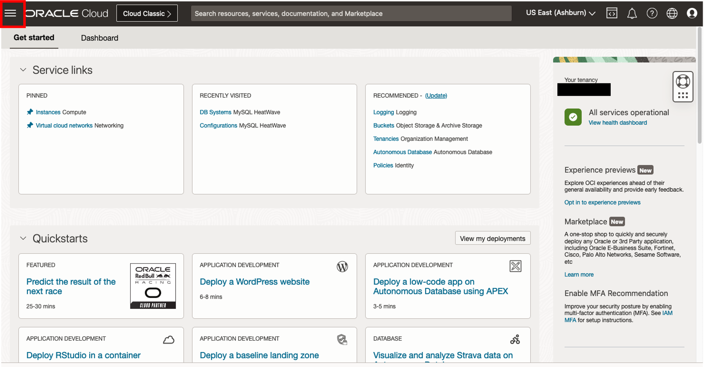
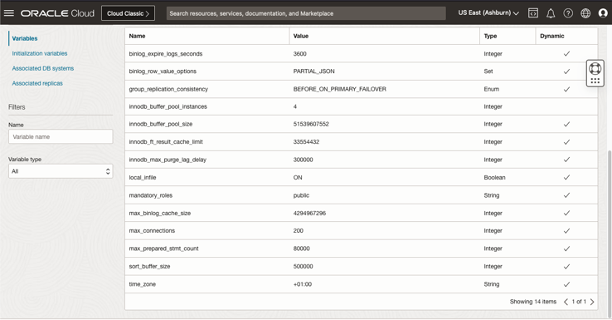
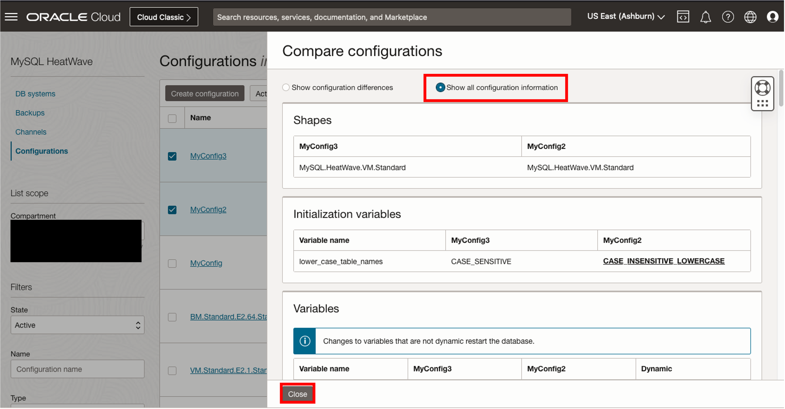
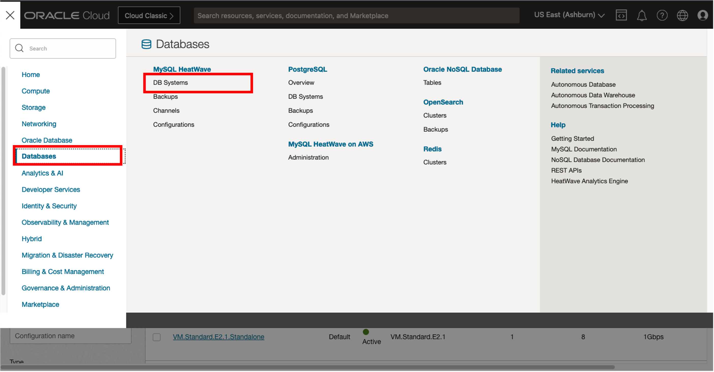
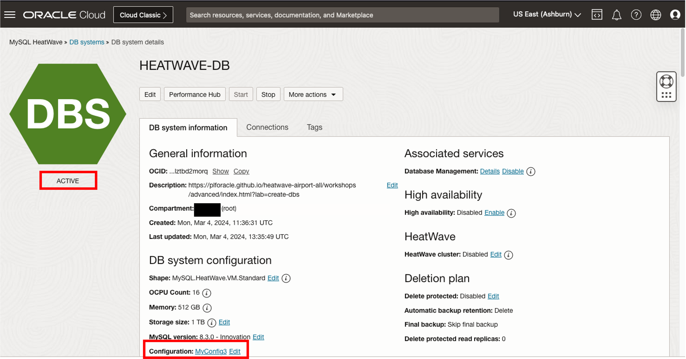
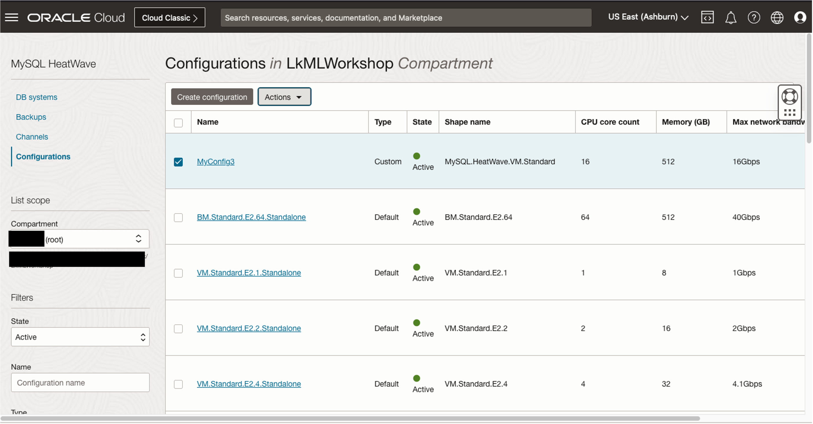

# Configuring MySQL DB System


## Introduction

In this lab, you will learn to manage configurations in MySQL DB System.

_Estimated Time:_ 10 minutes


### Objectives

In this lab, you will be guided through the following tasks:

- Create a MySQL Consiguration 
- Copy a MySQL Configuration, change variables and compare them
- Update the MySQL Configuration of a DB system
- Delete unused MySQL Confiigurations

### Prerequisites

- An Oracle Trial or Paid Cloud Account
- Some Experience with MySQL Shell
- Completed Task 3

## Task 1: Create a MySQL Configuration

1. Click **Navigation Menu**,

    

2. Click  **Databases**, then **Configurations**  
    

    Select the root compartment
    

3. Select the Click **Create Configuration**
    

    Enter name

    ```bash
    <copy>MyConfig</copy>
    ```
    Make sure that the compartment name matches the root compartment. 
    

    
4. Click the Change Shape button and select the MySQL.HeatWave.VM.Standard shape 
    
    

5. Scroll down, the Variables Information page is displayed.the User Variables (Read/Write) sectiion add the following variables and values:

    * Set max_connections to 200
    * Set sort\_buffer\_size to 500000
    * Set time\_zone to +01:00

    

    **Note:** You can click the **+Another Variable** to add more rows for configuring more variables

6. Click Create to create the configuration. The configuration Details page is displayed. 
    

7. Scroll down to see the variables that you have configured
    


## Task 2: Copy a MySQL Configuration

1. On the MyConfig Details page, click **Copy Configuration** to make copy of the MyConfig configuration. 
    

2. The configuration copy page is displayed

    Enter name:

    ```bash
    <copy>MyConfig2</copy>
    ```

    

3. Scroll Down and click the **Initialization Variiables** tab, and enable the **Ignore case in table and schema names** option

    

4. Click Create to create the MyConfig2 configuration

5. Go back to the configurations list page
    

6. Click the context menu of MyConfig and click Copy Configuration 
    

    The configuration copy page is displayed
    Enter name:
    ```bash
    <copy>MyConfig3</copy>
    ```
    

7. Scroll down to the User variables (read/write) tab and perform the following changes:
    * Change the value of max_connections to 300
    * Change the value time_zone to +02:00. 
    * Click +Another Variable to add another row.

    

    *  Select autocomit in the Variable Name and OFF in the Variable value. 

    

8. Click Create to create MyConfig3 


## Task 3: Comparing two MySQL Configuration

1. Go back to the configurations list page 
    
    
3. Select the MyConfig2 and MyConfig 3 confiigurations from the configurations list by selecting the check boxes. Then click the Actions button and select Compare from the drop-down menu
    

4. The Compare configurations dialog box is shown. It shows the differences by default. 

    

    If you want to view all informatiion of both configurations, click the Show all configuration Information button. 
    

    Click Close. 

## Task 4: Update the Configuration of a DB System

1. Click **Navigation Menu**, click  **Databases**, then **DB Systems**  
    

3. Click on HEATWAVE-DB to view the deatils.  
    

4. Click the Edit button to edit the DB System
    

4. The edit DB system page is shown. Scroll down to the Configuration section, click the Change Configuration button to choose a different configuration.
    

    The browse configuration dialog is displayed. Note that it only lists all configurations that match the shape of the DB System.
    Click the Custom button to hide the default configurations 
    

    Select MyConfig2 configuration error messahe is displayed, this is because the initilization variable cannot be changed once the DB System has been deployed. 
    
    
5. Select the MyConfig3 configuration and click Select a Configuration. 
    

6. Click Save Changes in the Edit DB System page. HEATWAVE-DB changes to an updating state, after changing the configuration, the database needs to be restarted for the changes to take effect. 
    

7. After it has restared, the database will change to ACTIVE state and the configuration shows MyConfig3. 
    


## Task 5: Delete MySQL Configuration

1. Click **Navigation Menu**, then **Configurations**  
    

    Make sure you are in the root compartment
    

3. Select the MyConfig3, MyConfig2 and MyConfig configurations by selecting the respective check boxes, click the actions button and select the Delete from the drop down menu
    

4. Click Delete configurations too confirm
    

5. An error occurs and the deletion of the MyConfig3 configuration fails. Click Show Details to view the reason. 

    
    As shown on the details, the MyConfig3 configuration cannot be deleted because it is currently being used by a DB system.
    Click close on the details page. 

6. On the configuration list page, you will notice that MyConfig2 and MyConfig configurations have been deleted.
    


You may now **proceed to the next lab**

## Acknowledgements

- **Author** - Perside Foster, MySQL Principal Solution Engineering
- **Contributors** - Mandy Pang, MySQL Principal Product Manager,  Nick Mader, MySQL Global Channel Enablement & Strategy Manager
- **Last Updated By/Date** - Perside Foster, MySQL Solution Engineering, July 2023