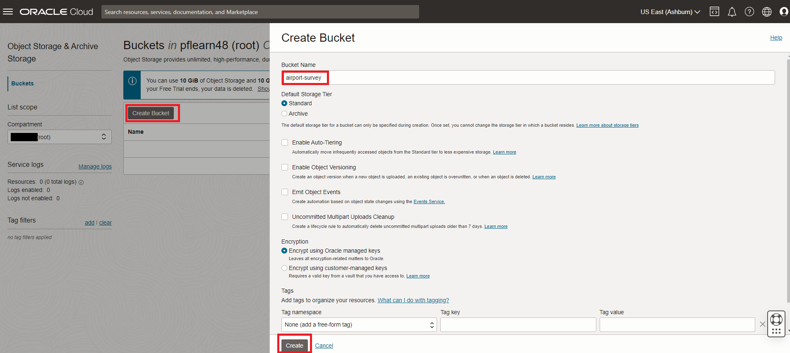
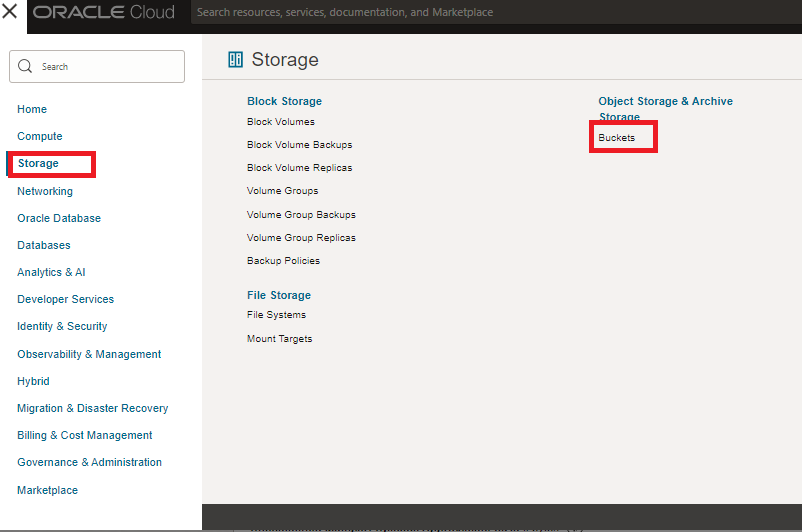
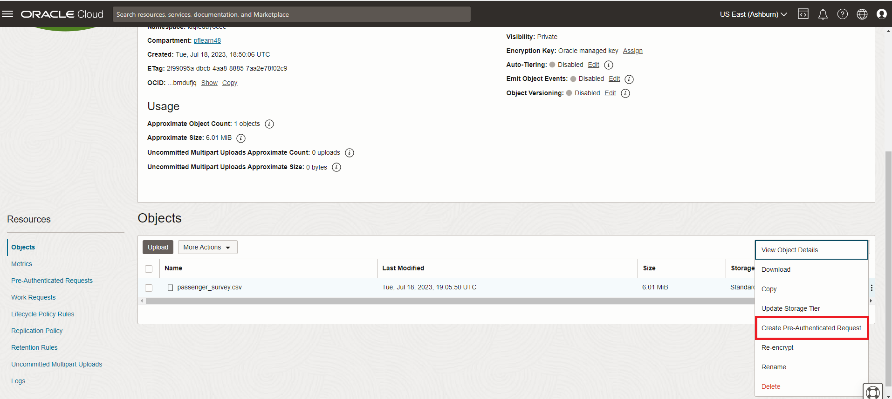
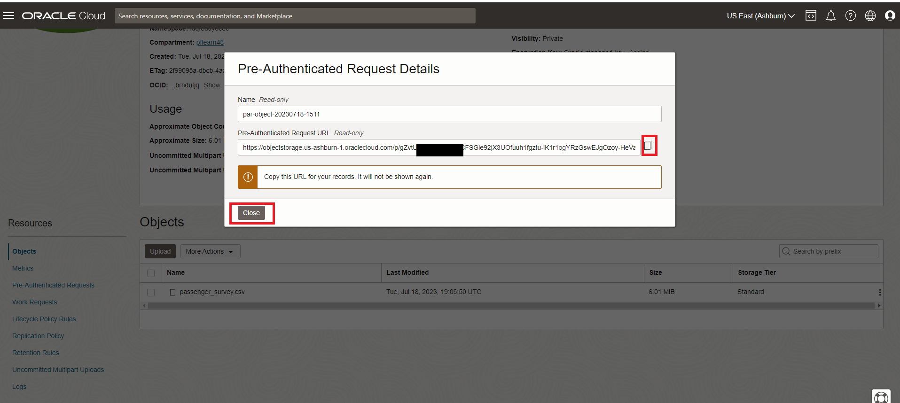
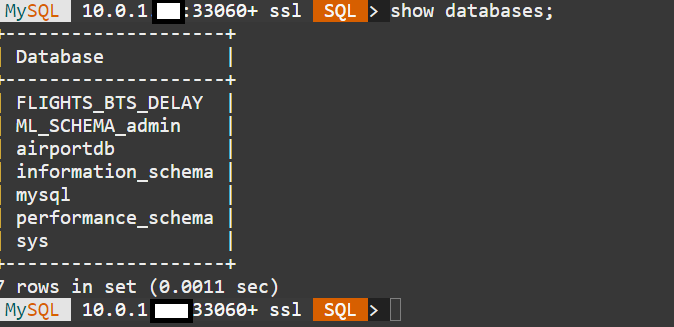

# Do HeatWave Lakehouse


## Introduction

MySQL HeatWave includes MySQL HeatWave Lakehouse, letting users query hundreds of terabytes of data in object storage—in a variety of file formats, such as CSV, Parquet, and Aurora/Redshift export files from other databases. Customers can query transactional data in MySQL databases, data in various formats in object storage, or a combination of both using standard MySQL commands. Querying data in object storage is as fast as querying data inside the database.

### Objectives

In this lab, you will be guided through the following tasks:

- Create Object Storage bucket
- Upload survey data
- Create PAR Link for the  survey file
- Run Autoload to infer the schema and estimate capacity
- Load survey table from Object Store into MySQL HeatWave cluster

### Prerequisites

- An Oracle Trial or Paid Cloud Account
- Some Experience with MySQL Shell
- Completed Lab 4

## Task 1: Download survey file to your local machine

1. From Windows Local machine click  this  link from your browser:

    [https://objectstorage.us-ashburn-1.oraclecloud.com/p/JZjT3fuhsUXWBdOPVvLnP0Mx1ApX9Jj5z5iSxge4uS_lBjRqHv2md6IuRu2MUJUp/n/mysqlpm/b/mysql_airport/o/passenger_survey.csv](https://objectstorage.us-ashburn-1.oraclecloud.com/p/JZjT3fuhsUXWBdOPVvLnP0Mx1ApX9Jj5z5iSxge4uS_lBjRqHv2md6IuRu2MUJUp/n/mysqlpm/b/mysql_airport/o/passenger_survey.csv) 

2. From Linux or Mac Enter from terminal

    ```bash
    <copy>https://objectstorage.us-ashburn-1.oraclecloud.com/p/JZjT3fuhsUXWBdOPVvLnP0Mx1ApX9Jj5z5iSxge4uS_lBjRqHv2md6IuRu2MUJUp/n/mysqlpm/b/mysql_airport/o/passenger_survey.csv</copy>
    ```

## Task 2: Create Object Storage bucket

1. Sign in to OCI using your tenant name, user name and password.
2. Once signed in select the **root** compartment
3. From the Console navigation menu, click **Storage**.
4. Under Object Storage, click Buckets

    **NOTE:** Ensure the correct Compartment is selected : Select **root**

    

5. Click Create Bucket. The Create Bucket pane is displayed.
6. Enter a Bucket Name **airport-survey**
7. Under Default Storage Tier, click Standard. Leave all the other fields at their default values.
8. Click Create

    

## Task 3: Upload airportdb data

1. In the Buckets page, click the **airport-survey** name to load images into. The bucket's details page is displayed.
2. Under Resources, click Objects to display the list of objects in the bucket.
3. Click Upload. The Upload Objects pane is displayed.
4. Select the files from the unzippe airport-db local folder
    - Click open to load the passenger_survey.csv file
    - Click the Upload button
       

    - Wait for the **Abort** to change into **close**
       

    - Click the **close** button

## Task 4: Create the PAR Link for the "delivery_order" files

1. To create a PAR URL
    - Go to menu **Storage —> Buckets**
     

    - Select **lakehouse-files —> order**  folder.
2. Select the first file —> **delivery-orders-1.csv** and click the three vertical dots.
3. Click on **Create Pre-Authenticated Request**

    

4. The **Object** option will be pre-selected.
5. Keep **Permit object reads** selected
6. Kep the other options for **Access Type** unchanged.
7. Click the **Create Pre-Authenticated Request** button.

    

8. Click the **Copy** icon to copy the PAR URL.
    

9. Save the generated PAR URL; you will need it in the next task

## Task 5: Connect to your MySQL HeatWave system using Cloud Shell

1. If not already connected then connect to MySQL using the MySQL Shell client tool with the following command:

    ```bash
    <copy>mysqlsh -uadmin -p -h 10.0.1... --sql </copy>
    ```

    

2. List schemas in your heatwave instance

    ```bash
        <copy>show databases;</copy>
    ```

    

3. Change to the mysql\_customer\_orders database

    Enter the following command at the prompt

    ```bash
    <copy>USE mysql_customer_orders;</copy>
    ```

4. To see a list of the tables available in the mysql\_customer\_orders schema

    Enter the following command at the prompt

    ```bash
    <copy>show tables;</copy>
    ```

    You are now ready to use Autoload to load a table from the object store into MySQL HeatWave

## Task 6: Run Autoload to infer the schema and estimate capacity required for the DELIVERY table in the Object Store

1. Part of the DELIVERY information for orders is contained in the delivery-orders-1.csv file in object store for which we have created a PAR URL in the earlier task. In a later task, we will load the other files for the DELIVER_ORDERS table into MySQL HeatWave. Enter the following commands one by one and hit Enter.

2. This sets the schema we will load table data into. Don’t worry if this schema has not been created. Autopilot will generate the commands for you to create this schema if it doesn’t exist.

    ```bash
    <copy>SET @db_list = '["mysql_customer_orders"]';</copy>
    ```

3. This sets the parameters for the table name we want to load data into and other information about the source file in the object store. Substitute the **(PAR URL)** below with the one you generated in the previous task:

    ```bash
    <copy>SET @dl_tables = '[{
    "db_name": "mysql_customer_orders",
    "tables": [{
        "table_name": "delivery_orders",
        "dialect": 
           {
           "format": "csv",
           "field_delimiter": "\\t",
           "record_delimiter": "\\n"
           },
        "file": [{"par": "(PAR URL)"}]
    }] }]';</copy>
    ```

    - It should look like the following example (Be sure to include the PAR Link inside at of quotes("")):

        *SET @dl_tables = '[{
        "db_name": "mysql_customer_orders",
        "tables": [{
            "table_name": "delivery_orders",
            "dialect":
            {
            "format": "csv",
            "field_delimiter": "\\t",
            "record_delimiter": "\\n"
            },
            "file": [{"par": "https://objectstorage.us-ashburn-1.oraclecloud.com/p/MAGNmpjq3Ej4wX6LN6KaE3R9AM2_h_fQDhfM5C9SbKXO_Zbe4MdrTvypV5XsyHkS/n/mysqlpm/b/lakehousefiles/o/delivery-orders-1.csv"}]
        }] }]';*

4. This command populates all the options needed by Autoload:

    ```bash
    <copy>SET @options = JSON_OBJECT('mode', 'dryrun',  'policy', 'disable_unsupported_columns',  'external_tables', CAST(@dl_tables AS JSON));</copy>
    ```

5. Run this Autoload command:

    ```bash
    <copy>CALL sys.heatwave_load(@db_list, @options);</copy>
    ```

6. Once Autoload completes running, its output has several pieces of information:
    - a. Whether the table exists in the schema you have identified.
    - b. Auto schema inference determines the number of columns in the table.
    - c. Auto schema sampling samples a small number of rows from the table and determines the number of rows in the table and the size of the table.
    - d. Auto provisioning determines how much memory would be needed to load this table into HeatWave and how much time loading this data take.

7. Autoload also generated a statement lke the one below. Execute this statement now.

    ```bash
    <copy>SELECT log->>"$.sql" AS "Load Script" FROM sys.heatwave_autopilot_report WHERE type = "sql" ORDER BY id;</copy>
    ```

    

8. The execution result conatins the SQL statements needed to create the table and then load this table data from the Object Store into HeatWave.

    

9. Copy the **CREATE TABLE** command from the results. It should look like the following example

    *CREATE TABLE `mysql_customer_orders`.`delivery_orders`( `col_1` int unsigned NOT NULL, `col_2` bigint unsigned NOT NULL, `col_3` tinyint unsigned NOT NULL, `col_4` varchar(9) NOT NULL COMMENT 'RAPID_COLUMN=ENCODING=VARLEN', `col_5` tinyint unsigned NOT NULL, `col_6` tinyint unsigned NOT NULL, `col_7` tinyint unsigned NOT NULL) ENGINE=lakehouse SECONDARY_ENGINE=RAPID ENGINE_ATTRIBUTE='{"file": [{"par": "https://objectstorage.us-ashburn-1.oraclecloud.com/p/MAGNmpjq3Ej4wX6LN6KaE3R9AM2_h_fQDhfM5C9SbKXO_Zbe4MdrTvypV5XsyHkS/n/mysqlpm/b/lakehousefiles/o/delivery-orders-1.csv"}], "dialect": {"format": "csv", "field_delimiter": "\\t", "record_delimiter": "\\n"}}';*

10. Modify the **CREATE TABLE** command to replace the generic column names, such as **col\_1**, with descriptive column names. Use the following values:

    - `col_1 : orders_delivery`
    - `col_2 : order_id`
    - `col_3 : customer_id`
    - `col_4 : order_status`
    - `col_5 : store_id`
    - `col_6 : delivery_vendor_id`
    - `col_7 : estimated_time_hours`

11. Your modified **CREATE TABLE** command  should look like the following example:

    *CREATE TABLE `mysql_customer_orders`.`delivery_orders`( `orders_delivery` int unsigned NOT NULL, `order_id` bigint unsigned NOT NULL, `customer_id` tinyint unsigned NOT NULL, `order_status` varchar(9) NOT NULL COMMENT 'RAPID_COLUMN=ENCODING=VARLEN', `store_id` tinyint unsigned NOT NULL, `delivery_vendor_id` tinyint unsigned NOT NULL, `estimated_time_hours` tinyint unsigned NOT NULL) ENGINE=lakehouse SECONDARY_ENGINE=RAPID ENGINE_ATTRIBUTE='{"file": [{"par": "https://objectstorage.us-ashburn-1.oraclecloud.com/p/Jl8AjjtkPT8TDZZ-lK2qDj8oxVEZ2ah09fJN9Gl7XfhNBWBpzdvwOXkxx9Yz_SLi/n/iddftbilrksk/b/lakehouse-files-plf/o/order/delivery-orders-1.csv"}], "dialect": {"format": "csv", "field_delimiter": "\\t", "record_delimiter": "\\n"}}';*

12. Execute the modified **CREATE TABLE** command to create the delivery_orders table.

13. The create command and result should look lie this

    

## Task 4: Load complete DELIVERY table from Object Store into MySQL HeatWave

1. Run this command to see the table structure created.

    ```bash
    <copy>desc delivery_orders;</copy>
    ```

    

2. Now load the data from the Object Store into the ORDERS table.

    ```bash
    <copy> ALTER TABLE `mysql_customer_orders`.`delivery_orders` SECONDARY_LOAD; </copy>
    ```

3. Once Autoload completes,point to the schema

    ```bash
    <copy>use mysql_customer_orders</copy>
    ```

4. Check the number of rows loaded into the table.

    ```bash
    <copy>select count(*) from delivery_orders;</copy>
    ```

5. View a sample of the data in the table.

    ```bash
    <copy>select * from delivery_orders limit 5;</copy>
    ```

    a. Join the delivery_orders table with other table in the schema

    ```bash
    <copy> select o.* ,d.*  from  orders o
    join delivery_orders d on o.order_id = d.order_id
    where o.order_id = 93751524; </copy>
    ```

6. Your output for steps 2 thru 5 should look like this:

    

7. Your DELIVERY table is now ready to be used in queries with other tables. In the next lab, we will see how to load additional data for the DELIVERY table from the Object Store using different options.

You may now **proceed to the next lab**

## Acknowledgements

- **Author** - Perside Foster, MySQL Solution Engineering

- **Contributors** - Abhinav Agarwal, Senior Principal Product Manager, Nick Mader, MySQL Global Channel Enablement & Strategy Manager
- **Last Updated By/Date** - Perside Foster, MySQL Solution Engineering, May 2023
